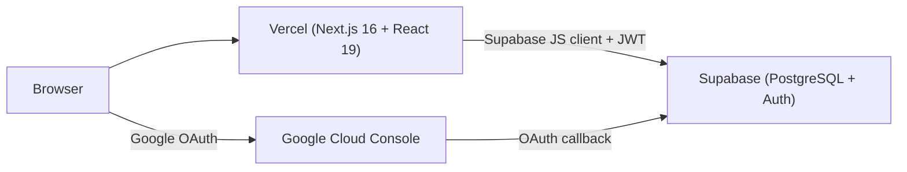
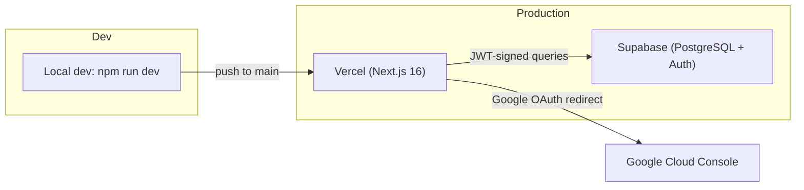

# PGCV Bioinformatics Dashboard — Architecture

> **Applies to:** `origin/main` as of 2026-07-20. Refreshed alongside `README.md` and `SECURITY.md` after the Sprint 3 Bioinformatics Services + audit-logging merges and the 7-phase UI/UX overhaul.

---

## 1. System Overview



**Data flow summary:**

1. User visits the Vercel-deployed Next.js app at `https://pgcv-bioinformatics-dashboard.vercel.app/`.
2. The dashboard layout (`app/dashboard/layout.tsx`) checks for a valid Supabase session — if missing, redirects to `/login`.
3. The login page (`app/login/page.tsx:14-27`) initiates a Google OAuth flow via Supabase Auth.
4. Google authenticates the user and redirects back to Supabase with an authorization code.
5. Supabase exchanges the code for a JWT and sets an HTTP-only session cookie.
6. All subsequent data requests from the frontend use the Supabase JS client, which automatically includes the JWT in the `Authorization: Bearer` header.
7. PostgreSQL Row-Level Security (RLS) evaluates `auth.uid()` and `get_user_role()` on every query to enforce per-row access control.

---

## 2. Technology Stack

| Layer | Technology | Version (source) |
|-------|-----------|-------------------|
| **Framework** | Next.js (App Router) | `16.2.10` (`package.json:15`) |
| **UI** | React | `19.2.4` (`package.json:16`) |
| **Language** | TypeScript | `^5` (`package.json:28`) |
| **Styling** | Tailwind CSS v4 | `^4` (`package.json:27`) |
| **Database** | Supabase (PostgreSQL) | Managed |
| **Auth** | Supabase Auth (Google OAuth) | `@supabase/supabase-js ^2.110.0` |
| **Server Supabase** | Supabase SSR | `@supabase/ssr` ^0.12.3 |
| **Hosting** | Vercel | Auto-deploy from `main` |
| **Charts** | Recharts | `^3.9.2` (`package.json:18`) |
| **Testing** | Vitest + Testing Library + jsdom | `vitest` + `@testing-library/react` + `jsdom` (dev) |
| **Icons** | Lucide React | `^1.23.0` (`package.json:14`) |

---

## 3. Codebase Organization

```
PGCV_BioInformatics_Dashboard/
├── .github/
│   └── workflows/
│       └── ci.yml                    # Phase 8: Lint + typecheck + build + test
├── app/
│   ├── layout.tsx                # Root layout; redirects / → /dashboard
│   ├── globals.css               # Tailwind v4 @theme tokens, font-face declarations
│   ├── page.tsx                  # Redirects to /dashboard
│   ├── components/               # Shared client components
│   │   ├── analysismodal.tsx         # New/edit sequence analysis form
│   │   ├── collaborationmodal.tsx    # Add/edit collaboration form modal
│   │   ├── dashboardbreadcrumbs.tsx  # Breadcrumb nav for nested routes
│   │   ├── dashboard-stat-cards.tsx  # Phase 5: Landing KPI cards
│   │   ├── dashboard-ui-context.tsx  # Phase 4: DashboardUIProvider + useDashboardUI
│   │   ├── datatable.tsx             # Reusable sortable/filterable table
│   │   ├── deletemodal.tsx           # Confirmation dialog for deletions
│   │   ├── pageheader.tsx            # Phase 3: Reusable PageHeader with breadcrumbs
│   │   ├── pagination.tsx            # Page-number paginator
│   │   ├── program-search-grid.tsx   # Phase 7: Client island for training/internship search
│   │   ├── project-distribution-chart.tsx # Phase 5: Landing donut chart
│   │   ├── projectmodal.tsx          # Add/edit project form modal
│   │   ├── samplemodal.tsx           # Sample sub-view (Task 6.5)
│   │   ├── service-report-modal.tsx  # Phase 5: Report generation modal
│   │   ├── service-reports-chart.tsx # Phase 5: Landing bar chart
│   │   ├── sessionauditor.tsx        # Mounts onAuthStateChange; calls audit_session_event RPC
│   │   ├── sidebar.tsx               # Nav links, user profile dropdown, sign-out button
│   │   ├── slidemodal.tsx            # Phase 3: Shared SlideOverModal + renderSectionLabel
│   │   ├── taskmodal.tsx             # Add/edit task form modal
│   │   ├── toast.tsx                 # Phase 5: ToastProvider + useToast
│   │   └── weekly-task-list.tsx      # Phase 5: Landing task list
│   ├── dashboard/                # All protected routes (auth-guarded by layout.tsx)
│   │   ├── layout.tsx            # Auth guard — supabase.auth.getSession(); redirects to /login
│   │   ├── page.tsx              # Landing: KPI cards, weekly tasks, Recharts charts
│   │   ├── error.tsx             # Phase 1: Route-level error boundary
│   │   ├── loading.tsx           # Phase 1: Route-level loading state
│   │   ├── not-found.tsx         # Phase 1: Route-level 404
│   │   ├── accomplishments/page.tsx  # Server component stub — "Coming Soon"
│   │   ├── calendar/page.tsx         # Server component stub — "Coming Soon"
│   │   ├── collaborations/page.tsx   # DB-integrated collab tracker (client component)
│   │   ├── projects/page.tsx         # DB-integrated project tracker (client component)
│   │   ├── repositories/page.tsx     # Server component stub — "Coming Soon"
│   │   ├── services/
│   │   │   ├── page.tsx              # Sequence Analysis tracker (client component)
│   │   │   ├── training/
│   │   │   │   ├── page.tsx          # Training program list (server component + ProgramSearchGrid)
│   │   │   │   └── [id]/{page,assessment,participants,evaluation,onboarding,certificate}
│   │   │   └── internship/
│   │   │       ├── page.tsx          # Internship program list (server component + ProgramSearchGrid)
│   │   │       └── [id]/{page,assessment,participants,evaluation,onboarding,certificate}
│   │   ├── services-list/page.tsx    # Server component stub — service catalog
│   │   └── tasks/page.tsx            # DB-integrated task CRUD (client component)
│   ├── fonts/                    # Aileron, Optima, Quicksand typefaces (OTF/TTF)
│   └── login/page.tsx            # Google OAuth sign-in page with DNA helix hero graphic
├── hooks/                        # Custom React hooks (Phase 4-6)
│   ├── useTableState.ts          # Sort + paginate hook with customSorters
│   ├── useDeleteRecord.ts        # Delete hook with onError callback
│   └── useServiceLookups.ts      # Typed lookup maps via useMemo
├── lib/
│   ├── breadcrumbs.ts            # Phase 3: Typed breadcrumb exports
│   ├── dashboard-stats.ts              # Phase 3: getDashboardStats + getServiceReportsByYear + DashboardStats type
│   ├── services-config.ts        # Phase 3: SERVICES_CONFIG
│   ├── supabase.ts               # Supabase client init + 6 data-access helpers (client-side)
│   ├── supabase-server.ts        # Phase 7: createServerSupabaseClient + getServerUser
│   └── utils.ts                  # Phase 3: formatDate utility
├── supabase/
│   └── migrations/               # 12 SQL files (base 19–24 + 5 timestamped add-ons + 25_reconcile_schema_drift)
│       ├── 19_initial_schema.sql             # 9 enums + 18 tables + indexes
│       ├── 20_security_functions.sql         # get_user_role(), protect_user_role_column()
│       ├── 21_enable_rls.sql                 # RLS enabled on all 18 tables
│       ├── 22_rls_policies.sql               # Per-table policies (30+)
│       ├── 23_audit_triggers.sql             # Audit + protect_user_role triggers
│       ├── 24_updated_at_triggers.sql        # Auto-updated_at on UPDATE
│       ├── 20260717000000_seed_biology_assessments.sql
│       ├── 20260718000000_audit_session_rpc.sql
│       ├── 20260720000000_audit_data_modification_rpc.sql
│       ├── 20260720000000_seed_demo_data.sql
│       └── 20260721000000_add_institution_to_users.sql
│
│  # Note: the local repo has 12 migration files, but the Supabase project
│  # has 23 applied migrations. See §18 / WORKBOOK §19 for the drift list.
├── types/
│   └── database.ts               # TypeScript interfaces: UserOption, CollaborationRow,
│                                  #   Project, ProjectStatus, STATUS_OPTIONS, ProjectFormData
├── vitest.config.mts             # Phase 8: Vitest configuration
├── vitest-setup.ts               # Phase 8: Test setup (jsdom, @testing-library/jest-dom)
├── .env.example                  # Documents required env vars
├── .gitignore                    # Excludes node_modules, .next, .env*
├── eslint.config.mjs
├── next.config.ts
└── package.json
```

---

## 4. Authentication Flow

The authentication flow is implemented across three files:

### Step-by-step

1. **Route guard** — `app/dashboard/layout.tsx:18-44` calls `supabase.auth.getSession()` on mount. If no `session` object is returned, `router.push("/login")` redirects the user to the sign-in page. A loading spinner renders while the session check is in flight.

2. **Sign-in initiation** — `app/login/page.tsx:14-27` ("Sign in with Google" button click handler) calls `supabase.auth.signInWithOAuth({ provider: 'google', options: { redirectTo: window.location.origin + '/' } })`.

3. **Google OAuth handshake** — The browser is redirected to Google's consent screen. After the user approves, Google redirects to Supabase's OAuth callback URL with an authorization code.

4. **JWT issuance** — Supabase Auth exchanges the code for a JWT and stores the session in an HTTP-only cookie (Supabase JS client default behavior).

5. **Post-login redirect** — The browser arrives at `/` (the `redirectTo` target), which is caught by `app/page.tsx` and redirected to `/dashboard`. The new session is now active.

6. **Subsequent requests** — All `supabase.from()` calls automatically include the JWT in the `Authorization: Bearer <token>` header. The Supabase Gateway validates the token and passes `auth.uid()` and `auth.role()` to PostgreSQL.

7. **Row-Level Security** — Every SQL query runs through RLS policies that evaluate `auth.uid()` (the authenticated user's ID) and the custom `get_user_role()` function (which reads the `role` column from `public.users`).

8. **Session lifecycle** — `app/dashboard/layout.tsx:33-39` subscribes to `supabase.auth.onAuthStateChange()` to handle token expiry and cross-tab sign-out events. If the session becomes invalid at any point, the listener redirects to `/login`.

9. **Sign-out** — `app/components/sidebar.tsx:138-141` calls `supabase.auth.signOut()`, which clears the HTTP-only cookie. The user is then redirected to `/login` via `router.push("/login")`.

> **Note:** OAuth success and sign-out **do** write `user_login` / `user_logout` rows to `audit_log` via the `audit_session_event` RPC, called from `app/components/sessionauditor.tsx` (mounted by `app/dashboard/layout.tsx`). The RPC is `REVOKE … FROM PUBLIC; GRANT … TO authenticated`. See [`SECURITY.md`](./SECURITY.md) §5.

---

## 5. Database Access Pattern

The app uses a **dual access pattern** — no custom API layer, no backend endpoints. All data access happens through Supabase JS clients in either a client-side or server-side context.

### Client-side (browser)

Client components use `lib/supabase.ts` (browser Supabase client via `createClient()`):

```
Browser Component
    ↕ supabase.from() / .select() / .insert() / .update() / .delete()
Supabase Gateway (JWT validation)
    ↕ RLS policy evaluation (auth.uid(), get_user_role())
PostgreSQL (18 tables)
```

Helpers available: `getRowsFromDB<T>`, `getNameIdFromDB<T>`, `saveDataToDB<T>`, `getUsersFromDB<T>`, `getCurrentUser`, `deleteDataFromDB` — all with generic type parameters (Phase 2).

### Server-side (React Server Components)

Server components use `lib/supabase-server.ts` (Phase 7):

```
Server Component
    ↕ createServerSupabaseClient()  ← reads cookie via next/headers
    ↕ getServerUser()               ← returns User | null
Supabase Gateway (JWT validation)
    ↕ RLS policy evaluation
PostgreSQL
```

Exported functions:
- `createServerSupabaseClient()` — reads the Supabase session cookie via `next/headers()` for RLS-gated server-side fetching.
- `getServerUser()` — returns the authenticated `User` object or `null`.

6 server components use this pattern: 4 stub pages (accomplishments, calendar, repositories, services-list) + the training and internship list pages.

### Key characteristics (shared)

- **No REST API layer** — Next.js does not expose custom `/api/` routes for CRUD. The Supabase client talks directly to the database.
- **RLS is the sole authorization layer** — there is no middleware-level access check beyond the initial session check in `app/dashboard/layout.tsx`.
- **Client-side `updated_at` workaround** — Migration 24's auto-`updated_at` trigger may not be applied to live Supabase. Components send `new Date().toISOString()` in their payloads (e.g., `app/dashboard/collaborations/page.tsx`). This is a fragile workaround — verify migration 24 is applied to the live DB, then drop the client-side `updated_at` writes.
- ~~**Landing KPI tiles used a hardcoded `yearlyMockDB`** — headline counts now come from `getDashboardStats()` in `lib/dashboard-stats.ts`, which runs real Supabase aggregations.~~ **RESOLVED in Phase 3**

---

## 6. Integration Layer (`lib/supabase.ts`)

The file `lib/supabase.ts` (161 lines after Phase 2 added generics and Phase 8 added eslint-disable comments) exports the Supabase client and a set of generic data-access helpers:

| Function | Signature | Description |
|----------|-----------|-------------|
| `supabase` | `createClient(url, key)` | Initialized Supabase client, exported as a named constant |
| `getCurrentUser()` | `() => Promise<User \| null>` | Returns the cached auth session's user object |
| `getUsersFromDB<T>(roles)` | `<T = any>(roles: string[]) => Promise<T[]>` | Fetches users filtered by `role` values (`team_lead`, `team_member`, `intern`, `trainee`); generic return type |
| `getNameIdFromDB<T>(table)` | `<T = { id: string; name: string }>(table: TableNames) => Promise<T[]>` | Returns `id` + `name` pairs for dropdown populators; generic return type |
| `getRowsFromDB<T>(table)` | `<T = any>(table: TableNames) => Promise<T[]>` | Fetches all rows from the given table; generic return type |
| `saveDataToDB<T>(table, uid, data)` | `<T extends Record<string, unknown>>(table: TableNames, uid: string, data: Partial<T>) => Promise<T>` | Upsert pattern — checks for existing row via `maybeSingle()`, updates or inserts; generic payload type |
| `deleteDataFromDB(table, id)` | `(table: TableNames, id: string) => Promise<void>` | Deletes a row by ID |

**Caveats:**

- `TableNames` now covers 16 of the 18 tables (added `"users"` in Phase 1): `collaboration, project, client, service, analysis, sample, service_report, training_program, training_session, module, onboarding_document, assessment, assessment_response, certificate, task, users`. `document_template` and `audit_log` remain server-triggered and are not in `TableNames`.
- The upsert path does not enforce that `id` is included in the payload; if the client omits it, `upsert()` creates a new row with a new UUID rather than using the intended `uid`.

---

## 7. Architectural Advances (Phases 1–8)

The eight-phase refactoring introduced the following cross-cutting architectural concepts.

### 7.1 Server Components (Phase 7)

- **6 pages** are now server components: 4 stubs (accomplishments, calendar, repositories, services-list) + training + internship.
- Server components use `createServerSupabaseClient()` from `lib/supabase-server.ts` to read cookies via `next/headers` for RLS-gated server-side fetching.
- Training/internship list pages embed `<ProgramSearchGrid />` as a client island for search interactivity.
- 4 CRUD pages (collaborations, projects, services, tasks) remain client components (evaluated but not converted — ~21–29h estimated effort).

### 7.2 Hooks Layer (Phase 4–6)

| Hook | Signature | Description |
|------|-----------|-------------|
| `useTableState<T>` | `(data: T[], options?: { customSorters?: Record<string, (a: T, b: T) => number>, defaultSort?: { key: string; direction: 'asc' \| 'desc' } }) => { sortedData, sortKey, sortDirection, handleSort, page, pageSize, totalPages, paginatedData, setPage }` | Combined sort + paginate with customSorters support |
| `useDeleteRecord<T>` | `(deleteFn: (id: string) => Promise<void>, options?: { onError?: (err: Error) => void }) => { deleteRecord, deleting }` | Delete wrapper with loading state and error callback |
| `useServiceLookups` | `() => { userMap, serviceMap, clientMap }` | Typed lookup maps (`Record<string, string>`) built via `useMemo` from DB queries |
| `useDashboardUI()` | `() => { isSidebarHidden, toggleSidebar }` | Sidebar state via React Context (`DashboardUIProvider`) |
| `useToast()` | `() => { showToast, toasts }` | Toast notifications for write-operation feedback |

### 7.3 Component Extraction (Phase 3–5)

- **`SlideOverModal`** — shared base for 5 modals, eliminating ~500 lines of duplicated slide-over logic.
- **`PageHeader`** — reusable header component for 6 pages with breadcrumb integration.
- **Dashboard page decomposed**: 806 → 351 lines (5 sub-components extracted: `DashboardStatCards`, `WeeklyTaskList`, `ServiceReportsChart`, `ProjectDistributionChart`, `ToastProvider`).
- **Services page decomposed**: 711 → 633 lines (report generation extracted to `ServiceReportModal`).

### 7.4 Performance (Phase 6)

- `React.memo` applied to `DataTable`, `Pagination`, `SlideOverModal` to prevent unnecessary re-renders.
- `useCallback` wrapped around all event handlers in CRUD pages (collaborations, projects, services, tasks).

### 7.5 Error Handling (Phase 1, 5)

- **Route-level**: `error.tsx`, `loading.tsx`, `not-found.tsx` in `app/dashboard/` catch unhandled errors, loading state, and 404s.
- **Page-level**: `loadError` state on 5 pages (collaborations, services, services/[id], training, internship).
- **Toast notifications**: `ToastProvider` + `useToast()` for write-operation success/failure feedback.

### 7.6 Quality Gates (Phase 8)

- **73 tests** (Vitest + React Testing Library) — co-located with source files.
- **CI pipeline**: `.github/workflows/ci.yml` — lint + typecheck + build + test on push/PR.
- **TypeScript strictness**: `noUncheckedIndexedAccess: true` in `tsconfig.json`.
- **ESLint**: `no-explicit-any: error` rule enabled.
- **Next.js hardening**: `reactStrictMode: true`, `poweredByHeader: false` in `next.config.ts`.

### 7.7 UI/UX Overhaul (7 phases, verified tsc 0 errors, lint 0 errors, build pass, 73/73 tests pass)

A comprehensive 7-phase UI/UX overhaul completed on 2026-07-20:

- **Phase 1 — Visual consistency + brand compliance:** New brand tokens `--color-surface` (#fffdf8) and `--color-brand-tint` (#e6f5ff) in `globals.css`; Quicksand @font-face fix; Aileron BLACK weight fix (700→900); `--color-white` contrast fix (#e6e7e8→#ffffff for WCAG AA); UP attribution added to sidebar + login copyright.
- **Phase 2 — Loading/Error/Empty states:** New `LoadingState`/`ErrorState`/`EmptyState` components in `app/components/state-views.tsx`; 4 route-level `loading.tsx` skeletons (projects, collaborations, tasks, services).
- **Phase 3 — Replace yearlyMockDB:** New `lib/dashboard-stats.ts` (`getDashboardStats()` + `getServiceReportsByYear()` + `DashboardStats` type); deleted `lib/mock-data.ts`.
- **Phase 4 — Accessibility pass:** Skip-to-content link in `app/dashboard/layout.tsx`; dialog semantics + focus trap on `slidemodal.tsx`; `aria-label` on nav/search; 22 `<label>`+`<input>` associations via `htmlFor`/`id` across 5 modals.
- **Phase 5 — Form validation + toasts:** Client-side validation on 5 modals with `aria-invalid` + inline `role="alert"` errors; 48 `showToast` calls across 6 files.
- **Phase 6 — Stub page polish:** Brand-aligned icon colors (amber/teal/purple accents), contextual Note callouts, `aria-hidden` on decorative icons.
- **Phase 7 — Mobile responsiveness:** Sidebar overlay + toggle button + backdrop + auto-close on nav; `p-4 md:p-8` padding; SSR-safe lazy initializer in `app/components/dashboard-ui-context.tsx`.

---

## 13. Data Model

The authoritative source is [`supabase/migrations/19_initial_schema.sql`](./supabase/migrations/19_initial_schema.sql) (422 lines). It defines **18 tables** and **9 custom enum types**.

### Custom Enum Types

| Enum | Values |
|------|--------|
| `user_roles` | `team_lead`, `team_member`, `trainee`, `intern`, `none` |
| `service_categories` | Lab-defined service categories |
| `analysis_status` | Analysis lifecycle stages |
| `collab_status` | `for_approval`, `ongoing`, `finished` |
| `training_type` | `training`, `internship` |
| `assessment_type` | `pre_test`, `post_test`, `evaluation` |
| `project_status` | `ongoing`, `for_approval`, `submitted`, `on_hold`, `completed` |
| `template_categories` | Document template types |
| `audit_log_action` | `state_change`, `data_deletion`, `role_change`, `data_export`, `data_modification`, `user_login`, `user_logout` |
| `task_status` | Task lifecycle states |
| `task_priority` | `low`, `medium`, `high` (column `task.priority` is now `text`, not the enum) |

### Table Summary

| Table | PK | Key Columns | FK References |
|-------|----|-------------|---------------|
| `users` | `id` (uuid) | `name`, `email`, `role` (`user_roles`), `track_assignment`, `created_at`, `updated_at` | — |
| `client` | `id` | `name`, `affiliation`, `contact_info`, `notes` | — |
| `service` | `id` | `name`, `description`, `category` (`service_categories`), `pipeline_default`, `active` | — |
| `document_template` | `id` | `category` (`template_categories`), `title`, `template_link`, `version` | — |
| `training_program` | `id` | `title`, `type` (`training_type`), `start_date`, `end_date`, `description` | `instructor_id` → `users(id)` |
| `project` | `id` | `name`, `status` (`project_status`), `start_date`, `target_delivery_date`, `repository_link` | `client_id` → `client(id)`, `service_id` → `service(id)`, `lead_user_id` → `users(id)` |
| `analysis` | `id` | `pipeline`, `pipeline_version`, `status` (`analysis_status`), `output_link` | `project_id` → `project(id)`, `assignee_id` → `users(id)` |
| `assessment` | `id` | `type` (`assessment_type`), `questions` (jsonb) | `program_id` → `training_program(id)` |
| `assessment_response` | `id` | `answers` (jsonb), `score` (smallint) | `assessment_id`, `participant_id` → `users(id)` |
| `audit_log` | `id` | `timestamp`, `user_id`, `action` (`audit_log_action`), `target_type`, `target_id`, `details` (jsonb) | `user_id` → `users(id)` |
| `certificate` | `id` | `issued_at`, `pdf_link` | `program_id` → `training_program(id)`, `participant_id` → `users(id)` |
| `collaboration` | `id` | `partner_org`, `status` (`collab_status`), `documents` (text[]), `repository_link` | `lead_user_id` → `users(id)` |
| `module` | `id` | `title`, `html_content_link`, `order`, `save_log_enabled` | `program_id` → `training_program(id)` |
| `onboarding_document` | `id` | `title`, `link`, `is_required` | `program_id` → `training_program(id)` |
| `sample` | `id` | `identifier`, `metadata` (jsonb) | `project_id` → `project(id)` |
| `service_report` | `id` | `report_link`, `delivered_at`, `delivered_by` | `analysis_id` → `analysis(id)`, `delivered_by` → `users(id)` |
| `task` | `id` | `title`, `due_date`, `status` (`task_status`), `priority` (`task_priority`) | `assignee_id` → `users(id)`, `linked_project_id` → `project(id)` |
| `training_session` | `id` | `date`, `title`, `module_link`, `attendance_required` | `program_id` → `training_program(id)` |

All foreign key constraints use `ON DELETE NO ACTION` (RESTRICT).

---

## 14. RLS Policy Summary

Source: [`supabase/migrations/22_rls_policies.sql`](./supabase/migrations/22_rls_policies.sql) (274 lines).

The role hierarchy is: `team_lead` ⊃ `team_member` ⊃ `trainee | intern`. "Staff" in policy terminology means `team_lead` OR `team_member`.

| Table | SELECT | INSERT | UPDATE | DELETE |
|-------|--------|--------|--------|--------|
| `users` | Row owner or staff | — | Row owner or staff | — |
| `audit_log` | `team_lead` only | (trigger only) | (no policy) | (no policy) |
| `analysis` | Staff | Staff | Staff | Staff |
| `assessment` | Staff, or trainee/intern (scoped) | Staff | Staff | Staff |
| `assessment_response` | Staff, or row owner | Participant (own) | Staff | Staff |
| `certificate` | Staff, or row owner | Staff | Staff | Staff |
| `client` | Staff | Staff | Staff | Staff |
| `collaboration` | Staff | Staff | Staff | Staff |
| `document_template` | Staff | Staff | Staff | Staff |
| `module` | All authenticated | Staff | Staff | Staff |
| `onboarding_document` | All authenticated | Staff | Staff | Staff |
| `project` | All authenticated | Staff | Staff | Staff |
| `sample` | Staff | Staff | Staff | Staff |
| `service` | All authenticated | Staff | Staff | Staff |
| `service_report` | Staff | Staff | Staff | Staff |
| `task` | All authenticated | Staff | Staff | Staff |
| `training_program` | Staff, or trainee/intern (scoped) | Staff | Staff | Staff |
| `training_session` | Staff, or trainee/intern (scoped) | Staff | Staff | Staff |

**Key design decisions:**

- **Every table has RLS enabled** via `supabase/migrations/21_enable_rls.sql`.
- **`audit_log` is `team_lead`-only readable** and has no client-side INSERT/UPDATE/DELETE policies — all writes happen server-side via the `audit_table_change()` trigger function defined in `migration 20`.
- **`protect_user_role` trigger** (migration 20, referenced as "Migration 12" in live) prevents non-`team_lead` users from changing the `role` column on `users`. This is defense-in-depth — even if a policy were misconfigured, a `team_member` cannot promote themselves to `team_lead`.
- **No DELETE policy on `users`** — API-level deletion is blocked by RLS. Hard deletes require direct database superuser access (Supabase SQL Editor as `postgres`). See [`SECURITY.md`](./SECURITY.md) §9 for the procedure.

> **Caveat:** RLS policies are correct on paper but have not been exercised end-to-end with test accounts for all four roles (`team_lead`, `team_member`, `trainee`, `intern`). Some flows (Project/Collab CRUD, Services page filtering, landing analytics) are confirmed to work as a logged-in user; role-by-role verification is pending as Task 9.2 — see `SECURITY.md` §10.

---

## 15. Deployment Architecture



- **Vercel (Production):** Auto-deploys from the `main` branch. HTTPS enforced by Vercel's managed TLS. Environment variables (`NEXT_PUBLIC_SUPABASE_URL`, `NEXT_PUBLIC_SUPABASE_ANON_KEY`) set in the Vercel dashboard.
- **Supabase (Managed PostgreSQL):** Free-tier project at `https://bmfslitnlkhayxluygm.supabase.co`. Database-level access control via RLS. Auth provider configured with Google OAuth.
- **Cold-start risk:** Supabase's free tier may pause the database after periods of inactivity. The first request after a pause incurs a 30–60 second wake-up delay. This is documented in the transition plan per `project_management_plan.md:53-57`.
- **No staging environment** — `main` is both the development trunk and the production branch. Feature work happens on long-lived branches (e.g., `service_report`, `training_and_internship`) and is merged to `main` when ready.

---

## 16. Future Work

Items explicitly descoped to **P4 (Won't)** in the MoSCoW prioritization (`project_management_plan.md:41-43`):

- **User Management UI** — Role changes, user deletion, and an admin console are out of scope. The `protect_user_role` trigger prevents privilege escalation. Manual SQL Editor is the current admin interface.
- **Two-way Calendar** — The Calendar stub at `/dashboard/calendar` renders "Coming Soon." Full bi-directional calendar sync (Google Calendar or similar) is P4.
- **Full Accomplishments module** — The Accomplishments stub tracks publications, engagements, and extension works at a surface level only.
- **Services List as a live catalog** — The Services List stub currently renders a read-only page. Full CRUD for service categories is P4.
- **Repositories module** — Replaced by `repository_link` text fields on `project` and `collaboration` (the kickoff package's `01_project_brief.md:149-153` called for branded redirect links; the field-level workaround is documented in `compsci_activity_sheet.md:46, 58` and `WORKBOOK.md` §3).
- **Test walkthroughs** — No documented role-based-access test scripts exist yet. Task 9.2 (Sprint 3) is to create test accounts for all four roles, exercise the RLS policies, and capture the results.

---

## 17. Cross-references

| Topic | Doc |
|---|---|
| Team contacts, data model, sprint plan, training/internship content, gap tracker | [`WORKBOOK.md`](./WORKBOOK.md) |
| RLS policies, audit-logging, RA 10173 compliance, encryption-at-rest status | [`SECURITY.md`](./SECURITY.md) |
| Onboarding, local setup, deployment, known limitations | [`README.md`](./README.md) |

---

## 18. Supabase production state (as of 2026-07-20)

The local repo and the live Supabase project have drifted. This section captures the live state; the full gap list lives in [`WORKBOOK.md` §19](./WORKBOOK.md#19-supabase-production-state-as-of-2026-07-20).

### 18.1 Migration drift

- **12 files** in the local `supabase/migrations/` folder.
- **23 migrations** applied to production (different timestamps, different names).
- The local `19_initial_schema.sql` through `24_updated_at_triggers.sql` base files are **not** in the production migration list — they were applied via raw SQL before the migration tracking system was configured.
- 15 production hot-fixes (`rls_fixes`, `advisor_fixes`, `rename_user_table_to_users`, `consolidate_overlapping_policies`, etc.) are intentionally not in the local repo — they are retroactive fixes of the 19-24 base migrations, not part of the canonical migration path (removed in commit `362bb5d`). These represent the real production schema.

> **Action item (P0):** ~~Generate `supabase/migrations/25_reconcile_production.sql`~~ **DONE** — created as `supabase/migrations/25_reconcile_schema_drift.sql` (75 lines, idempotent) and applied as migration `20260720052542 reconcile_schema_drift` (23rd migration). Fixes 3 enum values, adds 2 functions, corrects 4 column types.

### 18.2 Functions

- **Local-defined and present in production:** `protect_user_role_column()`, `audit_table_change()`, `get_user_role()`, `audit_session_event(text, jsonb)`, `audit_data_modification(text, text, jsonb)`.
- **Present in production but not in local:** `audit_sessions()`, `handle_new_user()` (likely an auth-hook that auto-creates a `users` row on OAuth signup).
- **All SECURITY DEFINER functions are callable by `anon` and `authenticated`** (per Supabase linter). See `SECURITY.md` §13 for the mitigation list.

### 18.3 Schema additions vs. local

- `users.institution` (text, nullable) — added in production by `20260719144134_add_institution_to_users.sql`.
- `assessment.questions` is `jsonb` in production (changed from a text/array type in production migration `20260708014455`).
- `users` table was renamed from `user` in production migration `20260708014021` (relevant only if you write raw SQL against the DB).
- `audit_log.action` is now constrained by an enum (`audit_log_action`).

### 18.4 New enums in production

`user_roles` (team_lead, team_member, trainee, intern, none) · `service_categories` · `template_categories` · `training_type` · `project_status` · `analysis_status` · `assessment_type` (pre_test, post_test, evaluation) · `audit_log_action`.

### 18.5 Edge functions

One active edge function: `backup-audit` (no JWT verification by design — it is triggered by Supabase cron, not user traffic). Matches the spec in WORKBOOK §3.4.

