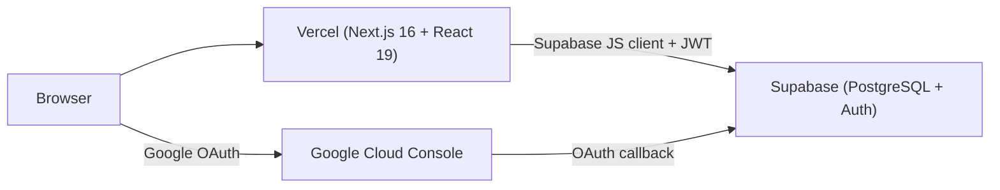
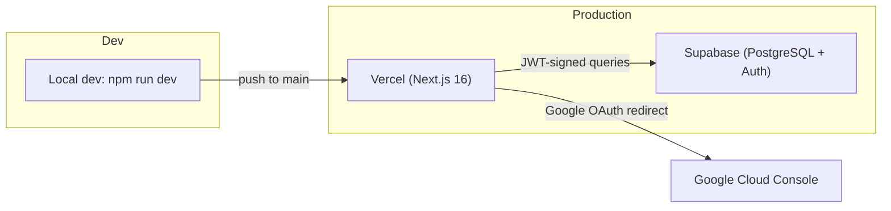

# PGCV Bioinformatics Dashboard — Architecture

> **Applies to:** `origin/main` as of 2026-07-19. Refreshed alongside `README.md` and `SECURITY.md` after the Sprint 3 Bioinformatics Services + audit-logging merges.

---

## 1. System Overview



**Data flow summary:**

1. User visits the Vercel-deployed Next.js app at `https://pgcv-bioinformatics-dashboard.vercel.app/`.
2. The dashboard layout (`app/dashboard/layout.tsx`) checks for a valid Supabase session — if missing, redirects to `/login`.
3. The login page (`app/login/page.tsx:14-27`) initiates a Google OAuth flow via Supabase Auth.
4. Google authenticates the user and redirects back to Supabase with an authorization code.
5. Supabase exchanges the code for a JWT and sets an HTTP-only session cookie.
6. All subsequent data requests from the frontend use the Supabase JS client, which automatically includes the JWT in the `Authorization: Bearer` header.
7. PostgreSQL Row-Level Security (RLS) evaluates `auth.uid()` and `get_user_role()` on every query to enforce per-row access control.

---

## 2. Technology Stack

| Layer | Technology | Version (source) |
|-------|-----------|-------------------|
| **Framework** | Next.js (App Router) | `16.2.10` (`package.json:15`) |
| **UI** | React | `19.2.4` (`package.json:16`) |
| **Language** | TypeScript | `^5` (`package.json:28`) |
| **Styling** | Tailwind CSS v4 | `^4` (`package.json:27`) |
| **Database** | Supabase (PostgreSQL) | Managed |
| **Auth** | Supabase Auth (Google OAuth) | `@supabase/supabase-js ^2.110.0` |
| **Hosting** | Vercel | Auto-deploy from `main` |
| **Charts** | Recharts | `^3.9.2` (`package.json:18`) |
| **Icons** | Lucide React | `^1.23.0` (`package.json:14`) |

---

## 3. Codebase Organization

```
PGCV_BioInformatics_Dashboard/
├── app/
│   ├── layout.tsx                # Root layout; redirects / → /dashboard
│   ├── globals.css               # Tailwind v4 @theme tokens, font-face declarations
│   ├── page.tsx                  # Redirects to /dashboard
│   ├── components/               # Shared client components (modals, sidebar, table, pagination, session auditor)
│   │   ├── analysismodal.tsx         # New/edit sequence analysis form
│   │   ├── collaborationmodal.tsx    # Add/edit collaboration form modal
│   │   ├── dashboardbreadcrumbs.tsx  # Breadcrumb nav for nested routes
│   │   ├── datatable.tsx             # Reusable sortable/filterable table
│   │   ├── deletemodal.tsx           # Confirmation dialog for deletions
│   │   ├── pagination.tsx            # Page-number paginator
│   │   ├── projectmodal.tsx          # Add/edit project form modal
│   │   ├── samplemodal.tsx           # Sample sub-view (Task 6.5)
│   │   ├── sessionauditor.tsx        # Mounts onAuthStateChange; calls audit_session_event RPC
│   │   ├── sidebar.tsx               # Nav links, user profile dropdown, sign-out button
│   │   └── taskmodal.tsx             # Add/edit task form modal
│   ├── dashboard/                # All protected routes (auth-guarded by layout.tsx)
│   │   ├── layout.tsx            # Auth guard — calls supabase.auth.getSession(); redirects to /login if absent
│   │   ├── page.tsx              # Landing page: analytics cards, weekly tasks, upcoming events, Recharts charts
│   │   ├── accomplishments/page.tsx  # Stub — "Coming Soon"
│   │   ├── calendar/page.tsx         # Stub — "Coming Soon"
│   │   ├── collaborations/page.tsx   # DB-integrated collab tracker
│   │   ├── projects/page.tsx         # DB-integrated project tracker
│   │   ├── repositories/page.tsx     # Stub — "Coming Soon"
│   │   ├── services/
│   │   │   ├── page.tsx              # 3.3.1 Sequence Analysis tracker (tabbed; 3.3.2/3.3.3 link out)
│   │   │   ├── services-list/page.tsx# Hardcoded service catalog
│   │   │   ├── training/
│   │   │   │   ├── page.tsx          # Training program list (DB-driven)
│   │   │   │   └── [id]/{page,assessment,participants,evaluation,onboarding,certificate}
│   │   │   └── internship/
│   │   │       ├── page.tsx          # Internship program list (DB-driven)
│   │   │       └── [id]/{page,assessment,participants,evaluation,onboarding,certificate}
│   │   └── tasks/page.tsx            # DB-integrated task CRUD
│   ├── fonts/                    # Aileron, Optima, Quicksand typefaces (OTF/TTF)
│   └── login/page.tsx            # Google OAuth sign-in page with DNA helix hero graphic
├── lib/
│   └── supabase.ts               # Supabase client init + 6 data-access helpers
├── supabase/
│   └── migrations/               # 11 SQL files (base 19–24 + 5 timestamped add-ons)
│       ├── 19_initial_schema.sql             # 9 enums + 18 tables + indexes
│       ├── 20_security_functions.sql         # get_user_role(), protect_user_role_column()
│       ├── 21_enable_rls.sql                 # RLS enabled on all 18 tables
│       ├── 22_rls_policies.sql               # Per-table policies (30+)
│       ├── 23_audit_triggers.sql             # Audit + protect_user_role triggers
│       ├── 24_updated_at_triggers.sql        # Auto-updated_at on UPDATE
│       ├── 20260717000000_seed_biology_assessments.sql
│       ├── 20260718000000_audit_session_rpc.sql
│       ├── 20260720000000_audit_data_modification_rpc.sql
│       ├── 20260720000000_seed_demo_data.sql
│       └── 20260721000000_add_institution_to_users.sql
│
│  # Note: the local repo has 11 migration files, but the Supabase project
│  # has 22 applied migrations. See §11 / WORKBOOK §19 for the drift list.
├── types/
│   └── database.ts               # TypeScript interfaces: UserOption, CollaborationRow,
│                                  #   Project, ProjectStatus, STATUS_OPTIONS, ProjectFormData
├── .env.example                  # Documents required env vars
├── .gitignore                    # Excludes node_modules, .next, .env*
├── eslint.config.mjs
├── next.config.ts
└── package.json
```

---

## 4. Authentication Flow

The authentication flow is implemented across three files:

### Step-by-step

1. **Route guard** — `app/dashboard/layout.tsx:16-40` calls `supabase.auth.getSession()` on mount. If no `session` object is returned, `router.push("/login")` redirects the user to the sign-in page. A loading spinner renders while the session check is in flight.

2. **Sign-in initiation** — `app/login/page.tsx:14-27` ("Sign in with Google" button click handler) calls `supabase.auth.signInWithOAuth({ provider: 'google', options: { redirectTo: window.location.origin + '/' } })`.

3. **Google OAuth handshake** — The browser is redirected to Google's consent screen. After the user approves, Google redirects to Supabase's OAuth callback URL with an authorization code.

4. **JWT issuance** — Supabase Auth exchanges the code for a JWT and stores the session in an HTTP-only cookie (Supabase JS client default behavior).

5. **Post-login redirect** — The browser arrives at `/` (the `redirectTo` target), which is caught by `app/page.tsx` and redirected to `/dashboard`. The new session is now active.

6. **Subsequent requests** — All `supabase.from()` calls automatically include the JWT in the `Authorization: Bearer <token>` header. The Supabase Gateway validates the token and passes `auth.uid()` and `auth.role()` to PostgreSQL.

7. **Row-Level Security** — Every SQL query runs through RLS policies that evaluate `auth.uid()` (the authenticated user's ID) and the custom `get_user_role()` function (which reads the `role` column from `public.users`).

8. **Session lifecycle** — `app/dashboard/layout.tsx:29-35` subscribes to `supabase.auth.onAuthStateChange()` to handle token expiry and cross-tab sign-out events. If the session becomes invalid at any point, the listener redirects to `/login`.

9. **Sign-out** — `app/components/sidebar.tsx:149-152` calls `supabase.auth.signOut()`, which clears the HTTP-only cookie. The user is then redirected to `/login` via `router.push("/login")`.

> **Note:** OAuth success and sign-out **do** write `user_login` / `user_logout` rows to `audit_log` via the `audit_session_event` RPC, called from `app/components/sessionauditor.tsx` (mounted by `app/dashboard/layout.tsx`). The RPC is `REVOKE … FROM PUBLIC; GRANT … TO authenticated`. See [`SECURITY.md`](./SECURITY.md) §5.

---

## 5. Database Access Pattern

The app uses a **direct-from-frontend** access pattern — no custom API layer, no backend endpoints. All data access happens through the Supabase JS client running in browser-side or server-component code:

```
Browser Component
    ↕ supabase.from() / .select() / .insert() / .update() / .delete()
Supabase Gateway (JWT validation)
    ↕ RLS policy evaluation (auth.uid(), get_user_role())
PostgreSQL (18 tables)
```

**Key characteristics:**

- **No REST API layer** — Next.js does not expose custom `/api/` routes for CRUD. The Supabase client talks directly to the database.
- **RLS is the sole authorization layer** — there is no middleware-level access check beyond the initial session check in `app/dashboard/layout.tsx`.
- **Client-side `updated_at` workaround** — Migration 24's auto-`updated_at` trigger may not be applied to live Supabase. Components send `new Date().toISOString()` in their payloads (e.g., `app/dashboard/collaborations/page.tsx`). This is a fragile workaround — verify migration 24 is applied to the live DB, then drop the client-side `updated_at` writes.
- **Landing KPI tiles use a hardcoded `yearlyMockDB`** — headline counts (Active Projects, Pending Tasks, Total Services) are demo values. Charts use real Supabase queries. Real counts will replace the mock when the bio track confirms the exact metric definitions.

---

## 6. Integration Layer (`lib/supabase.ts`)

The file `lib/supabase.ts` (128 lines on `origin/main`) exports the Supabase client and a set of generic data-access helpers:

| Function | Signature | Description |
|----------|-----------|-------------|
| `supabase` | `createClient(url, key)` | Initialized Supabase client, exported as a named constant |
| `getCurrentUser()` | `() => Promise<User \| null>` | Returns the cached auth session's user object (uses `.then()` style — inconsistent with other async helpers) |
| `getUsersFromDB(roles)` | `(roles: string[]) => Promise<User[]>` | Fetches users filtered by `role` values (`team_lead`, `team_member`, `intern`, `trainee`) |
| `getNameIdFromDB(table)` | `(table: TableNames) => Promise<{id, name}[]>` | Returns `id` + `name` pairs for dropdown populators |
| `getRowsFromDB(table)` | `(table: TableNames) => Promise<Row[]>` | Fetches all rows from the given table |
| `saveDataToDB(table, uid, data)` | `(table: TableNames, uid: string, data: any) => Promise<Row>` | Upsert pattern — checks for existing row via `maybeSingle()`, updates or inserts |
| `deleteDataFromDB(table, id)` | `(table: TableNames, id: string) => Promise<void>` | Deletes a row by ID |

**Caveats:**

- `TableNames` covers 14 of the 18 tables: `collaboration, project, client, service, analysis, sample, service_report, training_program, training_session, module, onboarding_document, assessment, assessment_response, certificate, task`. **`users`, `document_template`, and `audit_log` are not included** — `getUsersFromDB` uses `supabase.from("users")` directly; the other two are server-triggered.
- `saveDataToDB` accepts `data: any` — no payload shape validation. A typo in the column name silently inserts garbage.
- The upsert path does not enforce that `id` is included in the payload; if the client omits it, `upsert()` creates a new row with a new UUID rather than using the intended `uid`.

---

## 7. Data Model

The authoritative source is [`supabase/migrations/19_initial_schema.sql`](./supabase/migrations/19_initial_schema.sql) (374 lines). It defines **18 tables** and **9 custom enum types**.

### Custom Enum Types

| Enum | Values |
|------|--------|
| `user_roles` | `team_lead`, `team_member`, `trainee`, `intern` |
| `service_categories` | Lab-defined service categories |
| `analysis_status` | Analysis lifecycle stages |
| `collab_status` | `for_approval`, `ongoing`, `finished` |
| `training_type` | `training`, `internship` |
| `assessment_type` | `pre_test`, `post_test`, `evaluation` |
| `project_status` | `ongoing`, `for_approval`, `submitted` |
| `template_categories` | Document template types |
| `audit_log_action` | `state_change`, `data_deletion`, `role_change`, `data_export`, `data_modification`, `user_login`, `user_logout` |
| `task_status` | Task lifecycle states |
| `task_priority` | `low`, `medium`, `high`, `critical` |

### Table Summary

| Table | PK | Key Columns | FK References |
|-------|----|-------------|---------------|
| `users` | `id` (uuid) | `name`, `email`, `role` (`user_roles`), `track_assignment`, `created_at`, `updated_at` | — |
| `client` | `id` | `name`, `affiliation`, `contact_info`, `notes` | — |
| `service` | `id` | `name`, `description`, `category` (`service_categories`), `pipeline_default`, `active` | — |
| `document_template` | `id` | `category` (`template_categories`), `title`, `template_link`, `version` | — |
| `training_program` | `id` | `title`, `type` (`training_type`), `start_date`, `end_date`, `description` | `instructor_id` → `users(id)` |
| `project` | `id` | `name`, `status` (`project_status`), `start_date`, `target_delivery_date`, `repository_link` | `client_id` → `client(id)`, `service_id` → `service(id)`, `lead_user_id` → `users(id)` |
| `analysis` | `id` | `pipeline`, `pipeline_version`, `status` (`analysis_status`), `output_link` | `project_id` → `project(id)`, `assignee_id` → `users(id)` |
| `assessment` | `id` | `type` (`assessment_type`), `questions` (jsonb) | `program_id` → `training_program(id)` |
| `assessment_response` | `id` | `answers` (jsonb), `score` (smallint) | `assessment_id`, `participant_id` → `users(id)` |
| `audit_log` | `id` | `timestamp`, `user_id`, `action` (`audit_log_action`), `target_type`, `target_id`, `details` (jsonb) | `user_id` → `users(id)` |
| `certificate` | `id` | `issued_at`, `pdf_link` | `program_id` → `training_program(id)`, `participant_id` → `users(id)` |
| `collaboration` | `id` | `partner_org`, `status` (`collab_status`), `documents` (text[]), `repository_link` | `lead_user_id` → `users(id)` |
| `module` | `id` | `title`, `html_content_link`, `order`, `save_log_enabled` | `program_id` → `training_program(id)` |
| `onboarding_document` | `id` | `title`, `link`, `is_required` | `program_id` → `training_program(id)` |
| `sample` | `id` | `identifier`, `metadata` (jsonb) | `project_id` → `project(id)` |
| `service_report` | `id` | `report_link`, `delivered_at`, `delivered_by` | `analysis_id` → `analysis(id)`, `delivered_by` → `users(id)` |
| `task` | `id` | `title`, `due_date`, `status` (`task_status`), `priority` (`task_priority`) | `assignee_id` → `users(id)`, `linked_project_id` → `project(id)` |
| `training_session` | `id` | `date`, `title`, `module_link`, `attendance_required` | `program_id` → `training_program(id)` |

All foreign key constraints use `ON DELETE NO ACTION` (RESTRICT).

---

## 8. RLS Policy Summary

Source: [`supabase/migrations/22_rls_policies.sql`](./supabase/migrations/22_rls_policies.sql) (274 lines).

The role hierarchy is: `team_lead` ⊃ `team_member` ⊃ `trainee | intern`. "Staff" in policy terminology means `team_lead` OR `team_member`.

| Table | SELECT | INSERT | UPDATE | DELETE |
|-------|--------|--------|--------|--------|
| `users` | Row owner or staff | — | Row owner or staff | — |
| `audit_log` | `team_lead` only | (trigger only) | (no policy) | (no policy) |
| `analysis` | Staff | Staff | Staff | Staff |
| `assessment` | Staff, or trainee/intern (scoped) | Staff | Staff | Staff |
| `assessment_response` | Staff, or row owner | Participant (own) | Staff | Staff |
| `certificate` | Staff, or row owner | Staff | Staff | Staff |
| `client` | Staff | Staff | Staff | Staff |
| `collaboration` | Staff | Staff | Staff | Staff |
| `document_template` | Staff | Staff | Staff | Staff |
| `module` | All authenticated | Staff | Staff | Staff |
| `onboarding_document` | All authenticated | Staff | Staff | Staff |
| `project` | All authenticated | Staff | Staff | Staff |
| `sample` | Staff | Staff | Staff | Staff |
| `service` | All authenticated | Staff | Staff | Staff |
| `service_report` | Staff | Staff | Staff | Staff |
| `task` | All authenticated | Staff | Staff | Staff |
| `training_program` | Staff, or trainee/intern (scoped) | Staff | Staff | Staff |
| `training_session` | Staff, or trainee/intern (scoped) | Staff | Staff | Staff |

**Key design decisions:**

- **Every table has RLS enabled** via `supabase/migrations/21_enable_rls.sql`.
- **`audit_log` is `team_lead`-only readable** and has no client-side INSERT/UPDATE/DELETE policies — all writes happen server-side via the `audit_table_change()` trigger function defined in `migration 20`.
- **`protect_user_role` trigger** (migration 20, referenced as "Migration 12" in live) prevents non-`team_lead` users from changing the `role` column on `users`. This is defense-in-depth — even if a policy were misconfigured, a `team_member` cannot promote themselves to `team_lead`.
- **No DELETE policy on `users`** — API-level deletion is blocked by RLS. Hard deletes require direct database superuser access (Supabase SQL Editor as `postgres`). See [`SECURITY.md`](./SECURITY.md) §9 for the procedure.

> **Caveat:** RLS policies are correct on paper but have not been exercised end-to-end with test accounts for all four roles (`team_lead`, `team_member`, `trainee`, `intern`). Some flows (Project/Collab CRUD, Services page filtering, landing analytics) are confirmed to work as a logged-in user; role-by-role verification is pending as Task 9.2 — see `SECURITY.md` §10.

---

## 9. Deployment Architecture



- **Vercel (Production):** Auto-deploys from the `main` branch. HTTPS enforced by Vercel's managed TLS. Environment variables (`NEXT_PUBLIC_SUPABASE_URL`, `NEXT_PUBLIC_SUPABASE_ANON_KEY`) set in the Vercel dashboard.
- **Supabase (Managed PostgreSQL):** Free-tier project at `https://bmfslitnlkhayxluygm.supabase.co`. Database-level access control via RLS. Auth provider configured with Google OAuth.
- **Cold-start risk:** Supabase's free tier may pause the database after periods of inactivity. The first request after a pause incurs a 30–60 second wake-up delay. This is documented in the transition plan per `project_management_plan.md:53-57`.
- **No staging environment** — `main` is both the development trunk and the production branch. Feature work happens on long-lived branches (e.g., `service_report`, `training_and_internship`) and is merged to `main` when ready.

---

## 10. Future Work

Items explicitly descoped to **P4 (Won't)** in the MoSCoW prioritization (`project_management_plan.md:41-43`):

- **User Management UI** — Role changes, user deletion, and an admin console are out of scope. The `protect_user_role` trigger prevents privilege escalation. Manual SQL Editor is the current admin interface.
- **Two-way Calendar** — The Calendar stub at `/dashboard/calendar` renders "Coming Soon." Full bi-directional calendar sync (Google Calendar or similar) is P4.
- **Full Accomplishments module** — The Accomplishments stub tracks publications, engagements, and extension works at a surface level only.
- **Services List as a live catalog** — The Services List stub currently renders a read-only page. Full CRUD for service categories is P4.
- **Repositories module** — Replaced by `repository_link` text fields on `project` and `collaboration` (the kickoff package's `01_project_brief.md:149-153` called for branded redirect links; the field-level workaround is documented in `compsci_activity_sheet.md:46, 58` and `WORKBOOK.md` §3).
- **Test walkthroughs** — No documented role-based-access test scripts exist yet. Task 9.2 (Sprint 3) is to create test accounts for all four roles, exercise the RLS policies, and capture the results.

---

## 11. Cross-references

| Topic | Doc |
|---|---|
| Team contacts, data model, sprint plan, training/internship content, gap tracker | [`WORKBOOK.md`](./WORKBOOK.md) |
| RLS policies, audit-logging, RA 10173 compliance, encryption-at-rest status | [`SECURITY.md`](./SECURITY.md) |
| Onboarding, local setup, deployment, known limitations | [`README.md`](./README.md) |

---

## 12. Supabase production state (as of 2026-07-19)

The local repo and the live Supabase project have drifted. This section captures the live state; the full gap list lives in [`WORKBOOK.md` §19](./WORKBOOK.md#19-supabase-production-state-as-of-2026-07-19).

### 12.1 Migration drift

- **11 files** in the local `supabase/migrations/` folder.
- **22 migrations** applied to production (different timestamps, different names).
- The local `19_initial_schema.sql` through `24_updated_at_triggers.sql` base files are **not** in the production migration list — they were applied via raw SQL before the migration tracking system was configured.
- 11 production hot-fixes (`rls_fixes`, `advisor_fixes`, `rename_user_table_to_users`, `consolidate_overlapping_policies`, etc.) were never committed back to the repo. These represent the real production schema.

> **Action item (P0):** Generate `supabase/migrations/25_reconcile_production.sql` from the current production state so a fresh `supabase db reset` reproduces production byte-for-byte.

### 12.2 Functions

- **Local-defined and present in production:** `protect_user_role_column()`, `audit_table_change()`, `get_user_role()`, `audit_session_event(text, jsonb)`, `audit_data_modification(text, text, jsonb)`.
- **Present in production but not in local:** `audit_sessions()`, `handle_new_user()` (likely an auth-hook that auto-creates a `users` row on OAuth signup).
- **All SECURITY DEFINER functions are callable by `anon` and `authenticated`** (per Supabase linter). See `SECURITY.md` §13 for the mitigation list.

### 12.3 Schema additions vs. local

- `users.institution` (text, nullable) — added in production by `20260719144134_add_institution_to_users.sql`.
- `assessment.questions` is `jsonb` in production (changed from a text/array type in `20260708014455`).
- `users` table was renamed from `user` in `20260708014021` (relevant only if you write raw SQL against the DB).
- `audit_log.action` is now constrained by an enum (`audit_log_action`).

### 12.4 New enums in production

`user_roles` (team_lead, team_member, trainee, intern, none) · `service_categories` · `template_categories` · `training_type` · `project_status` · `analysis_status` · `assessment_type` (pre_test, post_test, evaluation) · `audit_log_action`.

### 12.5 Edge functions

One active edge function: `backup-audit` (no JWT verification by design — it is triggered by Supabase cron, not user traffic). Matches the spec in WORKBOOK §3.4.

